<div align="center">

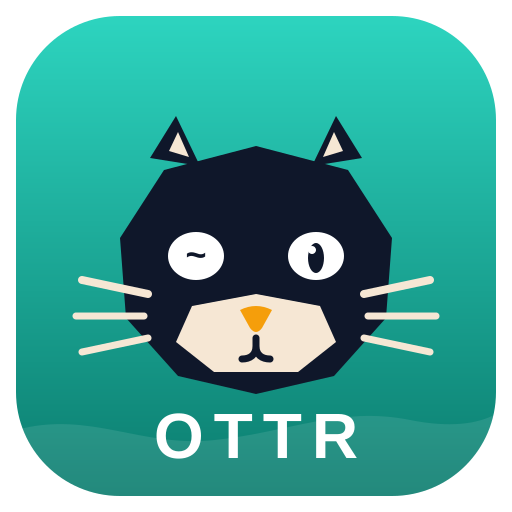

### AI 原生的个人服务器管理工具

*Swim through your servers.* ／ *如獭穿行于服务器之间。*

**开源 · 免费 · 三端（macOS / Windows / Linux）· 数据主权 100% 归你**

[](https://github.com/huluohu/Ottr)
[](#-下载与安装)
[](#-技术栈与工程结构)
[](#-测试)
[](#-许可与作者)

</div>

---

**Ottr** 把「连上服务器敲命令」升级为「AI 懂你的终端」：命令失败自动诊断、自然语言生成命令、全局历史检索，同时守住一条硬底线——**自带 AI Key（BYOK），请求直连你选的模型服务商并经脱敏，绝不经过任何第三方服务器**；主机、凭据、历史全部存在本机加密库或你自己的云盘里，隐私可以抓包自行验证。

技术栈 **Tauri 2 + Rust**（russh / russh-sftp）+ **React / TypeScript + xterm.js**，前后端命令契约由自动生成的 TS 绑定与契约测试双面钉住。安装包约 14 MB、运行内存约 100 MB，三端一套代码。

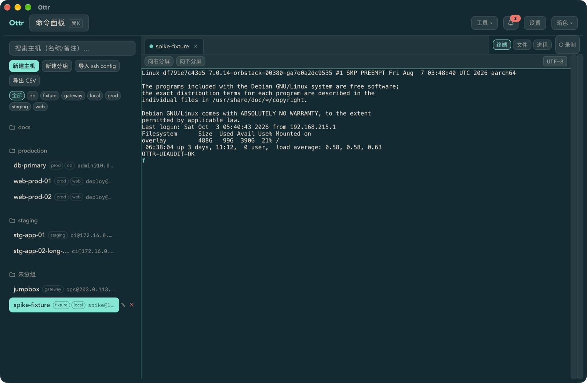

## ✨ 功能总览

### 终端与会话

- **标签页 + 分屏**（向右/向下），GPU 加速渲染，搜索、URL 识别、完整转义序列
- **编码自适应**：UTF-8 / GBK / GB18030 自动检测与一键切换（中文 Windows 服务器刚需）
- **断线自愈**：自动重连（退避）、keepalive 死链检测、连接健康状态灯、重启后还原标签
- **会话录制**：[asciinema v2](https://docs.asciinema.org/manual/asciinema-v2/) 格式，内置时间轴回放（拖动 / 倍速），可导出**脱敏文本**分享

### 主机与凭据

- 分组 / 标签 / 搜索 / **⌘K 模糊快速连接**；`~/.ssh/config` 导入、主机清单 CSV 导出，Tabby（JSON/YAML）、Xshell 第三方导入
- 凭据库：密码、SSH 密钥（ed25519/ecdsa/rsa，生成/导入/部署公钥）、TOTP 两步验证，按主机绑定
- **跳板链**：多级跳板可视化编排；**端口转发**：本地 / 动态 SOCKS / 远程，断线自动重挂
- known_hosts **TOFU 首次信任 + 指纹巡检**，防中间人

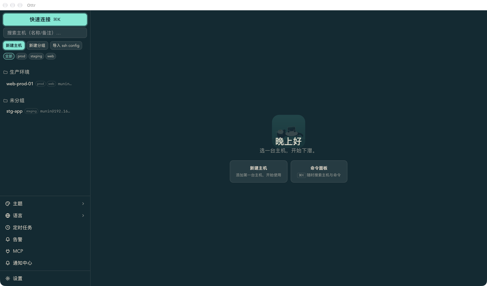

### AI 能力（核心卖点，隐私优先）

- **报错即诊**：命令非零退出自动浮出「原因 + 修复命令」，需确认才执行，危险命令红色标注
- **⌘J 自然语言 → 命令**：中文/英文意图直接生成单行命令（附当前目录锚点）
- **选中即释**：选中文本右键「解释 / 翻译 / 修复」；会话结束自动生成纪要，⌘R 全局检索
- **BYOK 多服务商**：OpenAI 兼容（**OpenAI / DeepSeek / 智谱 GLM / 任意自建端点**）、Anthropic Claude、本地 Ollama——预设一键填端点，Key 加密存本机
- **发送前脱敏**：主机名 / IP / 口令样式串自动替换为占位符；另内置 MCP 服务器，可接入 Claude Desktop 等宿主（主机级授权）

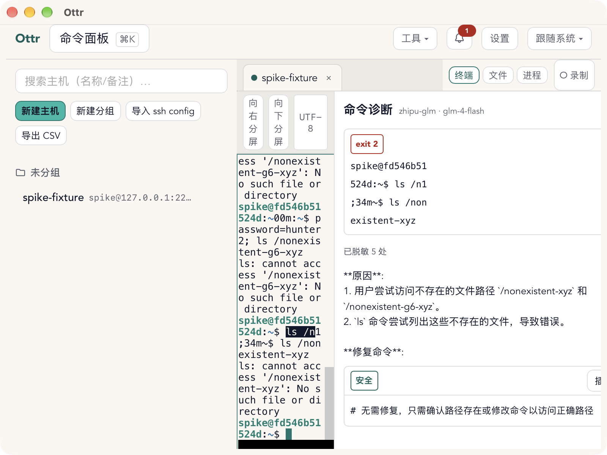

### 监控 · 告警 · 运维

- **免 Agent 监控**：CPU / 内存 / 磁盘 / 负载 / 网络实时曲线 + 进程浏览器，多主机总览
- **告警规则**（磁盘 / CPU / 进程 / 日志关键字）→ **12 种通知渠道**：企业微信、钉钉、飞书、Telegram、Slack、Discord、SMTP 邮件等国内外主流，限频 + 失败重试 + 投递记录持久化
- **定时任务**中心（Rust 侧调度，错过即知）、**批量执行**（多选主机 + 片段库 + 并发/超时控制）

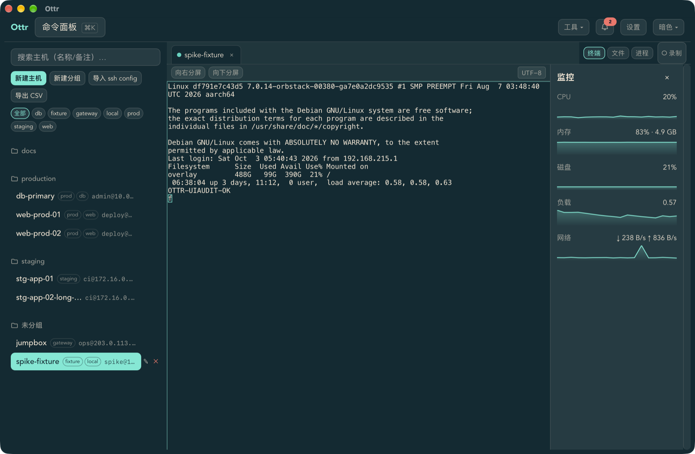

### 文件与同步

- **SFTP 双栏文件管理器**：拖拽传输、并行分块、断点续传；trzsz（trz/tsz）支持；FTP / FTPS
- **远程编辑**：本机编辑器直接改远端文件，原子保存（失败不损坏远端）、二进制嗅探防误编辑
- **多设备同步**：端到端加密信封（AES-256-GCM + PBKDF2），通道三选一（**WebDAV / Git / 本地目录**——WebDAV 走 Rust 代理直连你的网盘，无跨域限制），分类粒度推送/拉取，冲突逐类人工裁定

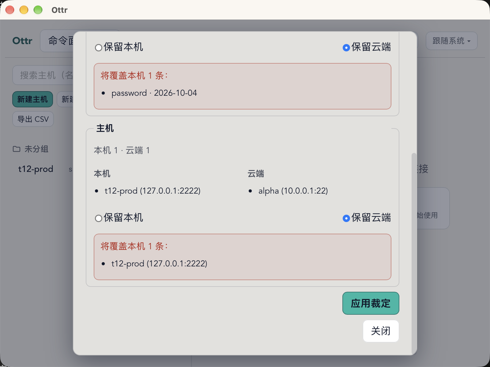

### 安全底座

- 本地库 **AES-256-GCM**：**钥匙链免密模式**为默认（主密钥存系统钥匙链，打开即用），
  **主密码模式**可选（Argon2id 派生，无密码不可解密），一键互转、数据跨模式重加密
- 敏感复制自动清除（剪贴板中的凭据按配置定时清空）、锁定屏「忘记密码」重置引导
  （二次确认，云端备份不受影响）
- 零遥测：不联网上传任何主机数据，行为可抓包自行验证

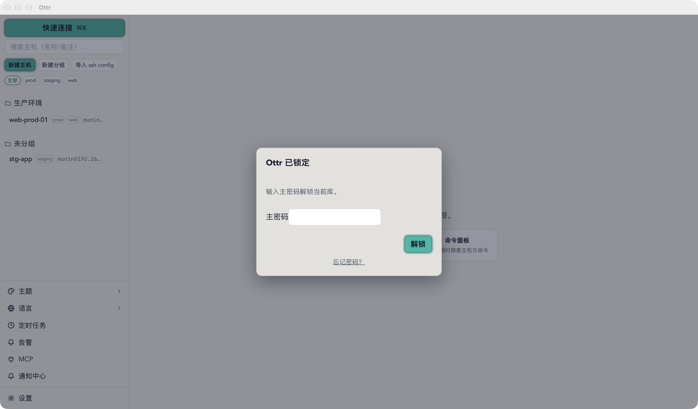

### 体验细节

- **七套主题**：亮色 / 暗色 / 跟随系统 / 曜黑（OLED 纯黑）/ 幻紫 / 青野 / 雾镜（真透明毛玻璃），
  终端配色逐主题跟随；支持 iTerm2 主题导入（含二进制 plist）与自定义配色
- 中文 / English 双语（菜单栏同步切换）；**macOS 原生菜单栏承载全部功能入口**
  （主题七选 / 工具 12 项 / 通知中心带未读数 / 新建主机与分组），Windows/Linux 自绘标题栏，三端托盘
- 凭据、告警、转发、跳板链、定时任务、MCP 均有专属面板；另有等宽字体连字、命令面板、插件系统（网络摘要 / 快捷命令）

<table>
  <tr>
    <td width="50%">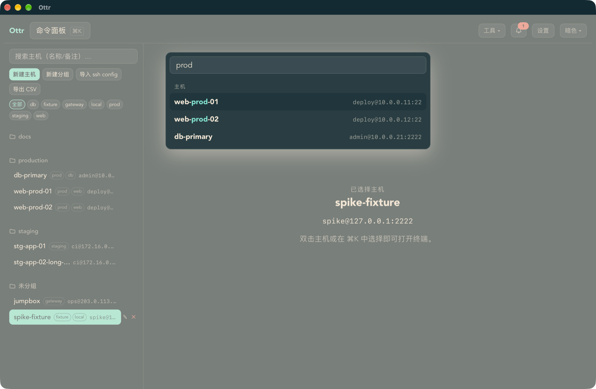</td>
    <td width="50%">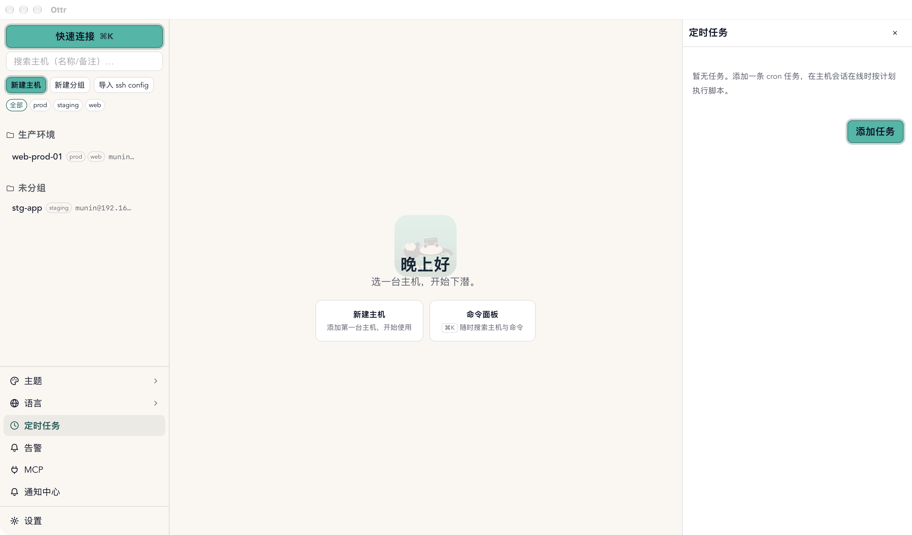</td>
  </tr>
  <tr>
    <td width="50%">⌘K 命令面板（模糊搜索）</td>
    <td width="50%">定时任务中心</td>
  </tr>
</table>

<details>
<summary>更多截图</summary>

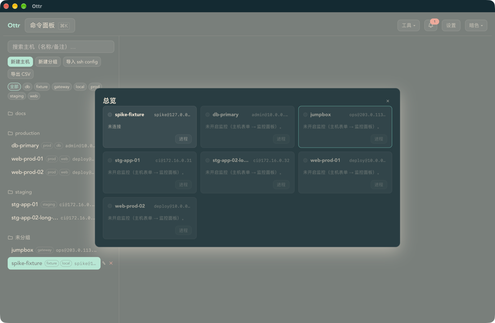
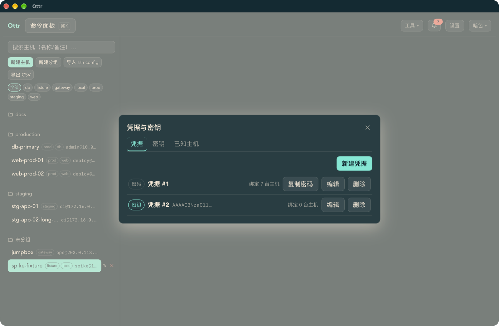
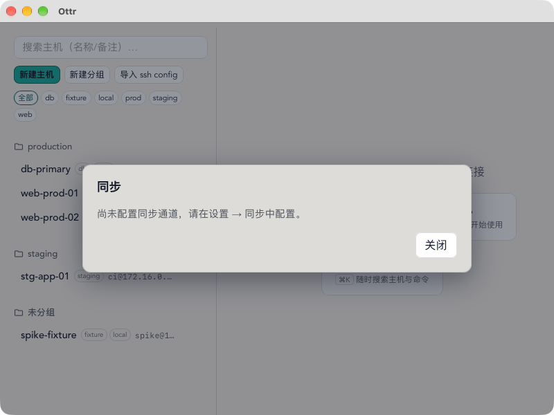

</details>

## 📦 下载与安装

前往 [**Releases**](https://github.com/huluohu/Ottr/releases) 下载对应平台安装包（推送版本标签后由 CI 自动构建发布）：

| 平台 | 格式 |
|---|---|
| macOS（Apple Silicon） | `.dmg` |
| Windows | `.msi` / `.exe`（安装向导） |
| Linux | `.deb` / `.rpm` / `.AppImage` |

首次启动会引导你建立本机加密库：**钥匙链模式**（免记密码，主密钥存系统钥匙链）或**主密码模式**（无密码不可解密，适合更高安全要求）。

## 🚀 快速上手

1. **加主机**：左侧「新建主机」（或菜单栏「文件 → 新建主机 / 新建分组」建分组归类）、
   「导入 ssh config」→ 双击主机行连接（首次连接展示指纹，信任后免问询）
2. **用 AI**：设置 → AI 助手 → 新增服务商（选「智谱 GLM」「DeepSeek」「Ollama」等预设，填 Key）→ 之后命令失败会自动诊断；`⌘J` 直接用中文要命令
3. **配告警**：菜单栏「工具 → 告警规则」→ 添加通知渠道（发测试消息验证）→ 建规则（如「根分区 > 90%」）
4. **多设备同步**：第二台设备装好后，设置 → 同步 → 选通道（如 WebDAV 填你的网盘地址）→ 设置同步口令 → 「立即同步」
5. **进阶**：`⌘R` 搜历史、`⌘D`/`⌘⇧D` 分屏；菜单栏「工具」还有端口转发 / 跳板链 /
   批量执行 / 定时任务 / 同步 / 导出主机 CSV / 通知中心（未读数直接标在菜单上）

## 🛠 技术栈与工程结构

```
├─ src/                    # 前端（React + TypeScript + zustand + i18next + xterm.js）
│  ├─ terminal/ workspace/ hosts/ credentials/ files/  # 终端 / 工作区 / 主机 / 凭据 / 文件
│  ├─ ai/ notify/ sync/ monitor/ history/ cron/        # AI / 通知 / 同步 / 监控 / 历史 / 定时任务
│  ├─ session/ security/ vault/ batch/ forward/        # 会话状态机 / 安全 / 库 API / 批量 / 转发
│  ├─ theme/ styles/ ui/ i18n/ shortcuts/ palette/     # 主题令牌 / 分节样式 / 基础组件 / 双语 / 键位 / ⌘K
│  └─ vault/bindings.generated.ts                      # Rust 命令 TS 绑定（tauri-specta 自动生成，漂移即测试红）
├─ src-tauri/              # Tauri 2 宿主 + 命令层（按域拆分：session/vault/mcp/…）
│  ├─ tests/               # 真容器夹具集成 + 契约守护（命令名集合比对 / 绑定一致性）
│  └─ crates/
│     ├─ ottr-vault        # 加密库（AES-256-GCM + Argon2id + 钥匙链 + 同步快照）
│     ├─ ottr-ssh          # SSH/SFTP 传输核（russh，trait 隔离 + PTY 收口层）
│     ├─ ottr-term         # 终端文本层（ANSI/OSC133 解析、编码、asciinema）
│     ├─ ottr-transfer     # SFTP 并行传输 / FTP
│     ├─ ottr-monitor      # 免 Agent 监控采样
│     └─ ottr-cron         # 定时任务引擎（五段式解析 + 调度 + 抖动原语）
├─ brand/                  # 品牌（logo 源文件 + 手册）
├─ docs/screenshots/       # README 截图（docs 其余为内部开发文档，不入库）
└─ .github/workflows/      # CI：tag → 三平台构建 + 自动发布；push → fmt + clippy + 编译冒烟
```

### 开发环境

**前置要求**：Node.js 22（仓库带 `.nvmrc`）、Rust stable（[rustup](https://rustup.rs/)），以及平台依赖——
macOS：Xcode CLT；Windows：MSVC Build Tools + [NASM](https://www.nasm.us/)（`aws-lc-sys` 需要）；Linux：`libwebkit2gtk-4.1-dev libgtk-3-dev libayatana-appindicator3-dev librsvg2-dev libxdo-dev libssl-dev`（Debian/Ubuntu 包名）。

```bash
npm install            # 前端依赖
npm run tauri dev      # 起 vite + Tauri 开发窗
```

### 测试

```bash
npm test               # 前端 vitest（1181 用例，含真夹具端到端）
cargo test             # Rust 工作区全部单测/集成测试（586）
cargo fmt --all --check
cargo clippy --workspace --all-targets   # CI 同款 -D warnings 门，零告警基线
```

本地 SSH/WebDAV 联调可起 Docker 夹具：`scripts/spike-sshd.sh`（127.0.0.1:2222）、`scripts/spike-dufs.sh`（127.0.0.1:15773）。仓库另有守护测试钉住设计约束（主题对比度实算、前后端命令名契约比对、TS 绑定与 Rust 签名一致性、控件一致性等）。

### 发布构建

```bash
npx tauri build        # 产出 dmg / msi / nsis / deb / rpm / AppImage（当前平台）
```

产物位于仓库根 `target/release/bundle/`。改了 `brand/icon.svg` 后用 `npx tauri icon brand/icon.svg` 重新生成全套图标。

### CI

- **`release.yml`**：推送 `v*` 标签 → 校验版本一致性 → 三平台矩阵构建（Linux 上带测试夹具跑全量前端测试）→ 自动发布 GitHub Release
- **`spike.yml`**：推送 main → `cargo fmt --check` + `cargo clippy -D warnings` + 三平台编译冒烟

### 已知开发环境坑（macOS Apple Silicon）

若 `npm run tauri dev` 链接期报 `unable to load libxcrun ... need 'x86_64'`：是 Node 跑在 Rosetta 下（`node -p process.arch` 显示 `x64`），npm 装了 x86_64 的 Tauri CLI 原生二进制。换 arm64 Node 并干净重装依赖：

```bash
nvm install 22 && nvm use 22 && node -p process.arch   # 应输出 arm64
rm -rf node_modules && npm install
```

同理 `cargo` / `npx tauri build` 报 `libxcrun ... missing compatible architecture`：是走了 x86_64 的 cargo（如 `/usr/local/bin/cargo`）。把原生 cargo 前置即可：

```bash
PATH="$HOME/.cargo/bin:/opt/homebrew/bin:/usr/bin:$PATH" npx tauri build
```

## 📋 项目状态

路线图 Phase 0–5、UI 改造、产品就绪、账本清零、主题套件、**原生菜单栏整合**
（顶栏功能全部收敛进菜单栏 + 关闭交互统一）与**结构收敛**（Rust 前后端 1760+
测试全绿、TS 绑定自动生成守护、clippy 零告警门）各批次**已全部交付并验收**
（本文档所列功能均为已实现状态）。仓库内 `docs/screenshots/` 为 README 截图；
开发过程文档（路线图 / 验收报告 / 运行手册）为内部资料，不入公开仓库。

## 📄 许可与作者

**Ottr** 由 [@huluohu](https://github.com/huluohu) 开发，以 [MIT](LICENSE-MIT) 协议开源——
欢迎 Issue 反馈与 PR；主仓库：[github.com/huluohu/Ottr](https://github.com/huluohu/Ottr)。

<div align="center">

*Swim through your servers.* 🦦

</div>
